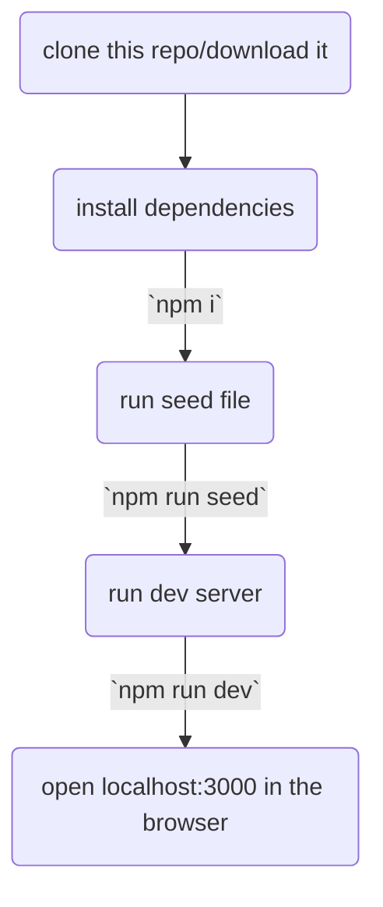

# Review It!

This is a project to mainly implement a lot of the concepts I've learnt along the way and apply them to build a full fledged product that gets extended over time. It's really easy to get set up and will probably work on all machines.

Currently you'll need a local instance of MongoDB running on port 12717 to use the app.

I'm planning on deploying this after I can put in safeguards in place so that people don't end up abusing my service provider. 

The issues tab contains a running list of changes(closed Issues) and expected features.

How to run this:

Commands are written inside the terminal or command line.

