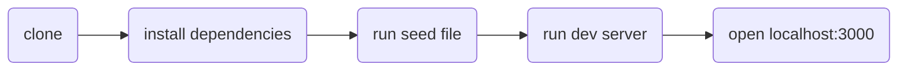

# Campgrounds viewer

How to run this:

```mermaid
flowchart LR
  A(clone)-->B(install dependencies)
  B(install dependencies)-->C(run seed file)
  C(run seed file)-->D(run dev server)
  D(run dev server)-->F(open localhost:3000)
```
