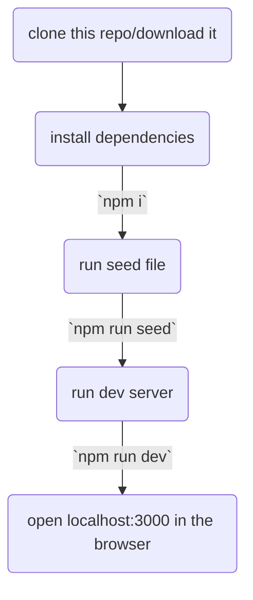

# Review It!

How to run this:

Commands are written inside the terminal or command line.

```mermaid
flowchart TD
  A(clone this repo/download it)-->B(install dependencies)
  B(install dependencies)-- `npm i` -->C(run seed file)
  C(run seed file)-- `npm run seed` -->D(run dev server)
  D(run dev server)-- `npm run dev` -->F(open localhost:3000 in the browser)
```
