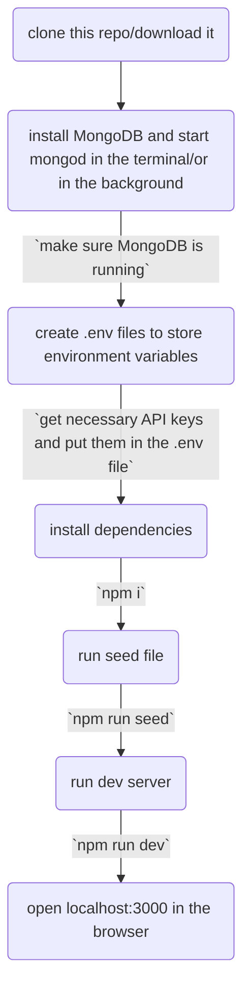

# Review It!

This is a project to mainly implement a lot of the concepts I've learnt along the way and apply them to build a full fledged product that gets extended over time.
It's really easy to get set up and will probably work on all machines.

Currently you'll need a local instance of MongoDB running on port 12717 to use the app.
Also note that, currently only Cloudinary image upload is supported so using another service isn't possible.
I'm planning to use the Facade Pattern to abstract this out so I(or anyone) can swap vendors.

How to install MongoDB: https://www.mongodb.com/docs/manual/administration/install-community/

Note that you need `mongod` which is the MongoDB daemon service to run MongoDB locally. You can verify if it's running using the `mongosh` command which opens the MongoDB shell client.

You will also need to setup a few environment variables, shown below is a skeleton of the .env file that needs to be created:

```

// Randomly generated secret to be used when storing sessions, can be anything really

SESSION_SECRET=

// URL that connects to the MongoDB instance, can also point to remote instances.
// The last part of the path `review_it` is the collection(database) name, you can change to your liking

DB_URL=mongodb://127.0.0.1:27017/review_it


// All of this is available if you sign in to Cloudinary and go to their API dashboard- https://cloudinary.com/

CLOUDINARY_API_SECRET=
CLOUDINARY_API_KEY=
CLOUDINARY_API_CLOUD_NAME=
//You may specify a folder to upload to but it may also be left blank
CLOUDINARY_FOLDER=

// Images to use when seeding and use as default when no image is provided
// These must be URLs pointing to images and it\'s best to have them hosted on your own server(such as on Cloudinary)

SEED_IMG=
DEFAULT_IMG=

// An API key from Maptiler for geocoding and styles- https://www.maptiler.com/

MAPTILER_API_KEY=

// These are used for Google OAuth, can be generated at- https://console.developers.google.com/
// A guide to create keys for OAuth is linked here- https://support.google.com/cloud/answer/6158849?hl=en
// Note: This flow only uses OpenID Connect and no permissions for other APIs are necessary

GOOGLE_CLIENT_ID=
GOOGLE_CLIENT_SECRET=

// Look inside emailVerificationService in the repo to get the gist
EMAIL_VERIFICATION_ENABLED=
EMAIL_VERIFICATION_API_BASE_URL=
EMAIL_VERIFICATION_API_KEY=
```

I'm planning on deploying this after I can put in safeguards in place so that people don't end up abusing my service provider.

The issues tab contains a running list of changes(closed Issues) and expected features.

## How to run this:

Commands are written inside the terminal or command line.


